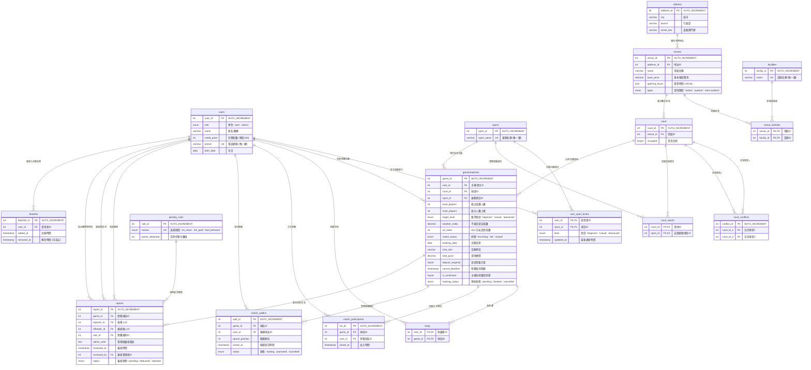

# 「不揪ㄛ」揪團平台——資料庫設計文件 (Database Design)

本文件詳細定義「不揪喔」運動與麻將揪團平台的資料庫結構設計，對齊專案最新版本之 [nojo525.sql](file:///c:/Users/cyhs1/OneDrive/桌面/明和/cgu/資料庫/database_project/db/nojo525.sql)。包含完整實體關係圖 (ERD)、各資料表架構 (Schema) 詳解、索引約束與外鍵級聯規則。

---

## 一、 實體關係圖 (Entity-Relationship Diagram)

以下為本平台 17 張資料表的關聯網絡圖，使用 Mermaid 語法繪製：

---

## 二、 資料表 Schema 詳解

### 1. `users` (使用者與管理員帳號表)
- **說明**: 儲存平台所有使用者基本資料、聯絡電話、生日及累計信譽積分。
- **欄位結構**:

| 欄位名稱 | 資料型態 | 允許空值 | 預設值 | 備註 / 約束 |
| :--- | :--- | :--- | :--- | :--- |
| `user_id` | `int(11)` | 否 | *AUTO_INCREMENT* | 主鍵 (PK) |
| `role` | `enum('user','admin')` | 否 | `'user'` | 權限身分 |
| `name` | `varchar(100)` | 否 | | 姓名或暱稱 |
| `credit_point` | `int(11)` | 否 | `100` | 信用積分，低於 60 限制使用 |
| `phone` | `varchar(20)` | 是 | `NULL` | 手機號碼，唯一限制鍵 (Unique Key) |
| `birth_date` | `date` | 是 | `NULL` | 用戶生日，供登入時計算年齡與驗證 |

---

### 2. `user_sport_levels` (使用者運動等級分級表)
- **說明**: 紀錄使用者在不同運動項目下的自我等級評定，用以媒合相近實力的球友。
- **欄位結構**:

| 欄位名稱 | 資料型態 | 允許空值 | 預設值 | 備註 / 約束 |
| :--- | :--- | :--- | :--- | :--- |
| `user_id` | `int(11)` | 否 | | 複合主鍵之一 & 外部鍵 (FK) 連接 `users.user_id` |
| `sport_id` | `int(11)` | 否 | | 複合主鍵之二 & 外部鍵 (FK) 連接 `sports.sport_id` |
| `level` | `enum('beginner','casual','advanced')` | 否 | | 運動能力級別 (新手/休閒/進階) |
| `updated_at` | `timestamp` | 否 | *CURRENT_TIMESTAMP ON UPDATE CURRENT_TIMESTAMP* | 自動更新修改時間 |

---

### 3. `sports` (支援運動項目表)
- **說明**: 平台支援之核心活動類別定義（如籃球、排球、羽球等，不包含月曆，麻將館資料採動態判定）。
- **欄位結構**:

| 欄位名稱 | 資料型態 | 允許空值 | 預設值 | 備註 / 約束 |
| :--- | :--- | :--- | :--- | :--- |
| `sport_id` | `int(11)` | 否 | *AUTO_INCREMENT* | 主鍵 (PK) |
| `sport_name` | `varchar(50)` | 否 | | 運動名稱，唯一限制鍵 (Unique Key) |

---

### 4. `address` (場館物理地址表)
- **說明**: 場館的定位與物理地址解析，將行政區細分利於地理半徑檢索。
- **欄位結構**:

| 欄位名稱 | 資料型態 | 允許空值 | 預設值 | 備註 / 約束 |
| :--- | :--- | :--- | :--- | :--- |
| `address_id` | `int(11)` | 否 | *AUTO_INCREMENT* | 主鍵 (PK) |
| `city` | `varchar(50)` | 否 | | 縣市 (如：台北市、新北市) |
| `district` | `varchar(50)` | 否 | | 行政區 (如：板橋區、大安區) |
| `street_line` | `varchar(255)` | 否 | | 道路與門牌詳細資訊 |

---

### 5. `venues` (場館與球場館表)
- **說明**: 儲存各大型運動場館（如國民運動中心、棋牌社或麻將館）的基本資訊與費用。
- **欄位結構**:

| 欄位名稱 | 資料型態 | 允許空值 | 預設值 | 備註 / 約束 |
| :--- | :--- | :--- | :--- | :--- |
| `venue_id` | `int(11)` | 否 | *AUTO_INCREMENT* | 主鍵 (PK) |
| `address_id` | `int(11)` | 否 | | 外部鍵 (FK) 連接 `address.address_id` |
| `name` | `varchar(100)` | 否 | | 場館或球館名稱 |
| `base_price` | `decimal(10,2)` | 否 | `0.00` | 基礎租借場地單價 |
| `opening_hours` | `json` | 是 | `NULL` | 營業時間範圍 JSON |
| `types` | `enum('indoor','outdoor','semi-outdoor')` | 是 | `NULL` | 場地環境類型，供天氣指數篩選 |

---

### 6. `facilities` (公共與加值設施定義表)
- **說明**: 平台支援之場地硬體設施主檔（如：淋浴間、停車場、冷氣等）。
- **欄位結構**:

| 欄位名稱 | 資料型態 | 允許空值 | 預設值 | 備註 / 約束 |
| :--- | :--- | :--- | :--- | :--- |
| `facility_id` | `int(11)` | 否 | *AUTO_INCREMENT* | 主鍵 (PK) |
| `name` | `varchar(50)` | 否 | | 設施名稱，唯一限制鍵 (Unique Key) |

---

### 7. `venue_facilities` (場館設施關聯多對多表)
- **說明**: 連接 `venues` 與 `facilities` 表，標記各場館擁有之設施。
- **欄位結構**:

| 欄位名稱 | 資料型態 | 允許空值 | 預設值 | 備註 / 約束 |
| :--- | :--- | :--- | :--- | :--- |
| `venue_id` | `int(11)` | 否 | | 複合主鍵之一 & 外部鍵 (FK) 連接 `venues.venue_id` |
| `facility_id` | `int(11)` | 否 | | 複合主鍵之二 & 外部鍵 (FK) 連接 `facilities.facility_id` |

---

### 8. `court` (場館內實體場地/桌次表)
- **說明**: 代表一個場館內複數的實體球場（A面場、B面場）或麻將桌桌次。
- **欄位結構**:

| 欄位名稱 | 資料型態 | 允許空值 | 預設值 | 備註 / 約束 |
| :--- | :--- | :--- | :--- | :--- |
| `court_id` | `int(11)` | 否 | *AUTO_INCREMENT* | 主鍵 (PK) |
| `venue_id` | `int(11)` | 否 | | 外部鍵 (FK) 連接 `venues.venue_id` |
| `occupied` | `tinyint(1)` | 否 | `0` | 是否有實體佔用中 (布林標記) |

---

### 9. `court_conflicts` (場地衝突與共用互斥表)
- **說明**: 解決實體球場邊界交疊或「半場/全場」租借互斥的邏輯。如：全場籃球場佔用時，左右兩個半場應自動互斥關閉預約。
- **欄位結構**:

| 欄位名稱 | 資料型態 | 允許空值 | 預設值 | 備註 / 約束 |
| :--- | :--- | :--- | :--- | :--- |
| `conflict_id` | `int(11)` | 否 | *AUTO_INCREMENT* | 主鍵 (PK) |
| `court_id_1` | `int(11)` | 否 | | 外部鍵 (FK) 連接 `court.court_id` |
| `court_id_2` | `int(11)` | 否 | | 外部鍵 (FK) 連接 `court.court_id`，且與 `court_id_1` 構成聯合唯一約束 |

---

### 10. `court_sports` (場地支援項目表)
- **說明**: 定義特定場地所能提供的運動類型。例如：同一個多功能羽網球場，同時可支援羽毛球與網球。
- **欄位結構**:

| 欄位名稱 | 資料型態 | 允許空值 | 預設值 | 備註 / 約束 |
| :--- | :--- | :--- | :--- | :--- |
| `court_id` | `int(11)` | 否 | | 複合主鍵之一 & 外部鍵 (FK) 連接 `court.court_id` |
| `sport_id` | `int(11)` | 否 | | 複合主鍵之二 & 外部鍵 (FK) 連接 `sports.sport_id` |

---

### 11. `gamesmatches` (揪團房間表)
- **說明**: 揪團核心商務主表，記錄發起球局（或麻將局）、時間段、所需人數、實體費用、取消期限、是否支付訂金與氣象環境參數。
- **欄位結構**:

| 欄位名稱 | 資料型態 | 允許空值 | 預設值 | 備註 / 約束 |
| :--- | :--- | :--- | :--- | :--- |
| `game_id` | `int(11)` | 否 | *AUTO_INCREMENT* | 主鍵 (PK) |
| `user_id` | `int(11)` | 否 | | 主揪用戶，外部鍵 (FK) 連接 `users.user_id` |
| `court_id` | `int(20)` | 否 | | 實體預約場地，外部鍵 (FK) 連接 `court.court_id` |
| `sport_id` | `int(11)` | 否 | | 運動類型，外部鍵 (FK) 連接 `sports.sport_id` |
| `least_players`| `int(11)` | 否 | | 最少成團人數門檻，未達則不成團 |
| `most_players` | `int(11)` | 否 | | 房間上限人數（達上限時轉為候補） |
| `target_level` | `enum('beginner','casual','advanced')`| 是 | `NULL`| 開房限制等級 |
| `weather_index`| `decimal(5,2)`| 是 | `NULL`| 不適合遊玩指數 |
| `air_index` | `int(11)` | 是 | `NULL`| 空氣品質 AQI 指數 |
| `match_status` | `enum('recruiting','full','closed')`| 否 | `'recruiting'`| 成團媒合狀態 |
| `booking_date` | `date` | 是 | `NULL`| 球局預訂日期 |
| `time_slot` | `varchar(50)` | 是 | `NULL`| 活動時段 (如：'18:00-20:00') |
| `total_price` | `decimal(10,2)`| 是 | `NULL`| 場地總價（後端依此計算分攤金額） |
| `deposit_required`| `tinyint(1)`| 否 | `0` | 臨時取消是否需要扣收訂金 |
| `cancel_deadline`| `timestamp` | 是 | `NULL`| 免費取消與退款的截止截止時間點 |
| `is_confirmed` | `tinyint(1)` | 否 | `0` | 免費場地：主揪開局到場站位確認狀態 |
| `booking_status`| `enum('pending','booked','cancelled')`| 否 | `'pending'`| 訂場交易與狀態記錄 |

---

### 12. `keep` (球友收藏球局表)
- **說明**: 多對多關係表，儲存使用者對特定進行中球局活動的收藏與關注。
- **欄位結構**:

| 欄位名稱 | 資料型態 | 允許空值 | 預設值 | 備註 / 約束 |
| :--- | :--- | :--- | :--- | :--- |
| `user_id` | `int(11)` | 否 | | 複合主鍵之一 & 外部鍵 (FK) 連接 `users.user_id` |
| `game_id` | `int(11)` | 否 | | 複合主鍵之二 & 外部鍵 (FK) 連接 `gamesmatches.game_id` |

---

### 13. `match_participants` (球局正式參與成員表)
- **說明**: 紀錄每一局已成功「加一」並被分配為正式隊員的球友清單。
- **欄位結構**:

| 欄位名稱 | 資料型態 | 允許空值 | 預設值 | 備註 / 約束 |
| :--- | :--- | :--- | :--- | :--- |
| `list_id` | `int(11)` | 否 | *AUTO_INCREMENT* | 主鍵 (PK) |
| `game_id` | `int(11)` | 否 | | 外部鍵 (FK) 連接 `gamesmatches.game_id` |
| `user_id` | `int(11)` | 否 | | 外部鍵 (FK) 連接 `users.user_id` |
| `joined_at` | `timestamp` | 否 | *CURRENT_TIMESTAMP* | 加入此球局的精確時間戳 |

*註：`game_id` 與 `user_id` 設有聯合唯一索引 (Unique Index)，嚴禁同一使用者在同一球局中重複報名。*

---

### 14. `match_waitlist` (球局候補排隊名單表)
- **說明**: 當球局人數已滿，額外報名的用戶將依序進入候補名單。
- **欄位結構**:

| 欄位名稱 | 資料型態 | 允許空值 | 預設值 | 備註 / 約束 |
| :--- | :--- | :--- | :--- | :--- |
| `wait_id` | `int(11)` | 否 | *AUTO_INCREMENT* | 主鍵 (PK) |
| `game_id` | `int(11)` | 否 | | 外部鍵 (FK) 連接 `gamesmatches.game_id` |
| `user_id` | `int(11)` | 否 | | 外部鍵 (FK) 連接 `users.user_id` |
| `queue_position`| `int(11)` | 否 | | 目前的候補順位編號 (1, 2, 3...) |
| `joined_at` | `timestamp` | 否 | *CURRENT_TIMESTAMP* | 候補登記時間戳 |
| `status` | `enum('waiting','promoted','cancelled')`| 否 | `'waiting'`| 候補狀態：排隊中/已遞補轉正/已取消 |

*註：`game_id` 與 `user_id` 構成唯一約束；同時 `game_id` 與 `queue_position` 也構成聯合唯一，確保同一球局的順位序列不會出現重複衝突。*

---

### 15. `reports` (賽後使用者檢舉審查表)
- **說明**: 提供賽後檢舉機制，處理放鳥、未付分攤費用或惡意行為，由管理員在後台介入裁決。
- **欄位結構**:

| 欄位名稱 | 資料型態 | 允許空值 | 預設值 | 備註 / 約束 |
| :--- | :--- | :--- | :--- | :--- |
| `report_id` | `int(11)` | 否 | *AUTO_INCREMENT* | 主鍵 (PK) |
| `game_id` | `int(11)` | 否 | | 外部鍵 (FK) 連接 `gamesmatches.game_id` |
| `reporter_id` | `int(11)` | 否 | | 檢舉發起人，外部鍵 (FK) 連接 `users.user_id` |
| `offender_id` | `int(11)` | 否 | | 被控違規人，外部鍵 (FK) 連接 `users.user_id` |
| `rule_id` | `int(11)` | 是 | `NULL` | 適用之處罰規章，外部鍵 (FK) 連接 `penalty_rules.rule_id` |
| `admin_note` | `text` | 是 | `NULL` | 管理員對本案的裁定備註與詳細說明 |
| `reviewed_at` | `timestamp` | 是 | `NULL` | 審核時間戳 |
| `reviewed_by` | `int(11)` | 是 | `NULL` | 承辦管理員，外部鍵 (FK) 連接 `users.user_id` |
| `status` | `enum('pending','deducted','rejected')`| 否 | `'pending'`| 案件狀態 (待審/已扣分/駁回不成立) |

*註：`game_id`、`reporter_id` 與 `offender_id` 構成三元聯合唯一索引，每人在同一球局對同一違規者限檢舉一次。*

---

### 16. `penalty_rules` (信譽扣分懲處規章表)
- **說明**: 系統制定的核心扣分規章與扣減基準值。
- **欄位結構**:

| 欄位名稱 | 資料型態 | 允許空值 | 預設值 | 備註 / 約束 |
| :--- | :--- | :--- | :--- | :--- |
| `rule_id` | `int(11)` | 否 | *AUTO_INCREMENT* | 主鍵 (PK) |
| `reason` | `enum('no_show','not_paid','bad_behavior')`| 否 | | 違規類型，唯一限制鍵 (Unique Key) |
| `points_deducted`| `int(11)` | 否 | | 當前項目所扣減的信用分數值 (例如放鳥扣20分) |

---

### 17. `blacklist` (黑名單封鎖紀錄表)
- **說明**: 紀錄因信譽積分扣除至門檻以下而被系統停權封鎖的用戶清單。
- **欄位結構**:

| 欄位名稱 | 資料型態 | 允許空值 | 預設值 | 備註 / 約束 |
| :--- | :--- | :--- | :--- | :--- |
| `blacklist_id` | `int(11)` | 否 | *AUTO_INCREMENT* | 主鍵 (PK) |
| `user_id` | `int(11)` | 否 | | 外部鍵 (FK) 連接 `users.user_id` |
| `added_at` | `timestamp` | 否 | *CURRENT_TIMESTAMP* | 寫入黑名單的停權時間 |
| `removed_at` | `timestamp` | 是 | `NULL` | 管理員手動解封或系統自動恢復的日期 |

---

## 三、 約束與級聯傳遞規則 (Constraints & Cascade Rules)

最新資料庫版本引入了嚴格的資料完整性外鍵約束 (Foreign Key Constraints) 及級聯操作：

1. **使用者被動移除影響 (Cascade Delete User)**:
   - `blacklist` 設有外鍵 `blacklist_ibfk_1` 指向 `users`。當刪除使用者時，其對應的黑名單封鎖紀錄將**級聯刪除** (`ON DELETE CASCADE`)。
   - `user_sport_levels` 設有外鍵 `user_sport_levels_ibfk_1` 指向 `users`。當刪除使用者時，其所屬之所有運動等級紀錄將**級聯刪除** (`ON DELETE CASCADE`)。
   - `match_participants`、`match_waitlist` 同理：使用者刪除時，其參戰與候補登記亦同步**級聯刪除**。

2. **球局解散與刪除影響 (Cascade Delete Game)**:
   - `match_participants` 設有外鍵 `match_participants_ibfk_1` 指向 `gamesmatches`。球局解散時，全體已加入成員的對應明細將**自動清理** (`ON DELETE CASCADE`)。
   - `match_waitlist` 設有外鍵 `match_waitlist_ibfk_1` 同步被**級聯刪除**。
   - `reports` 外鍵 `reports_ibfk_1`：若該球局被實體刪除，其衍生的賽後檢舉單將**級聯清除** (`ON DELETE CASCADE`)。
   - `keep` 外鍵 `keep_ibfk_2`：球局一旦消失，收藏該球局的明細也自動**級聯刪除**。

3. **場館與實體球場異動**:
   - `court` 指向 `venues`。當刪除場館時，該場館包含的所有實體球場將**級聯刪除**。
   - `gamesmatches` 指向 `court` 設有外鍵 `gamesmatches_ibfk_4`。若該實體球場資料遭到刪除，為保全現存揪團歷史，球局房的 `court_id` 欄位將**保留但置空**。

4. **安全更新傳遞 (On Update Cascade)**:
   - 所有關聯的對外鍵皆配置 `ON UPDATE CASCADE` 約束。若管理員後台異動了主鍵值（如更改 `sport_id` 或 `user_id`），關聯資料表中所有涉及的欄位值將**自動完成同步更新**，絕不產生資料孤兒。
