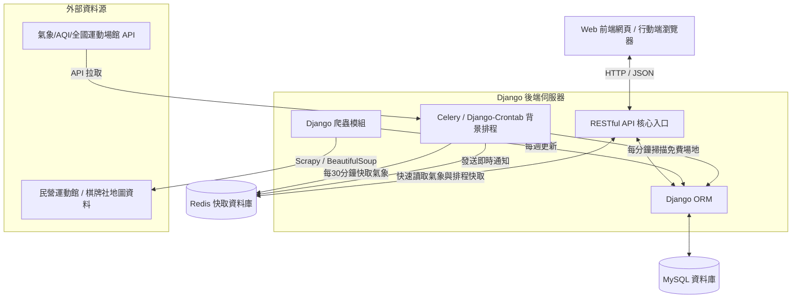
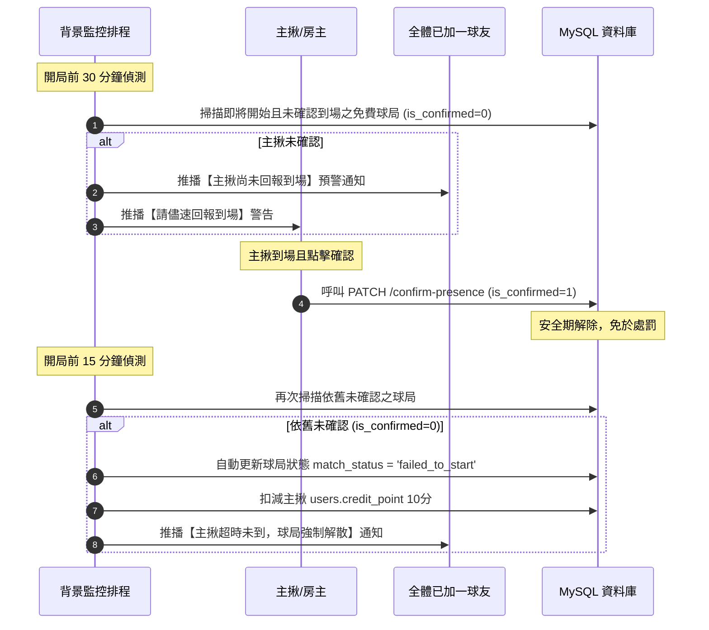

# 「不揪ㄛ」揪團平台——系統設計文件 (System Design Document)

本文件定義「不揪喔」運動與麻將揪團平台的完整系統設計，整合專案需求、資料庫結構（詳見 [資料庫設計文件](database.md)）與前後端 API 規格（詳見 [API 規格書](api_format.md)）。

---

## 一、 系統概述 (System Overview)

「不揪喔」是一個以運動與麻將揪團為核心的 Web-based 社交媒合平台。旨在協助使用者在北北桃地區快速尋找運動場地、媒合即時缺人的球局與牌局，並整合天氣狀況、空氣品質、場地租借與費用自動分攤等功能，解決「場地難尋、臨時缺人、天氣不穩、主揪負擔過重」四大痛點。

系統支援項目包含：**籃球、排球、羽毛球、以及麻將（棋牌局）**。

---

## 二、 系統技術架構 (System Architecture)

平台採用現代 Web 前後端分離架構，提供高響應、高並發且安全的服務環境：

### 1. 前端架構 (Frontend)
- **核心技術**: 語意化 HTML5、自適應響應式佈局 (Responsive Web Design) 與原生 JavaScript 邏輯控制。
- **視覺控制**: 採用 Vanilla CSS，搭配 CSS 變數定義全域設計系統（色彩、字體、圓角），提供流暢的微動畫 (Micro-interactions) 與現代質感深色模式。
- **使用者體驗**: 整合互動式月曆（有空時間選取器）與地圖定位（半徑範圍搜尋）。

### 2. 後端架構 (Backend)
- **核心框架**: **Django Web Framework**。
  - 選擇理由：內建功能強大的 **Django ORM**，可完美對接與管理資料表關聯；自帶 **Django Admin** 後台，便於管理員審核場地與裁決檢舉案；內建防禦機制 (CSRF, XSS, SQL Injection) 確保交易安全。
- **快取系統**: **Redis**。
  - 用途：快取每 30 分鐘同步一次的氣象降雨機率與 AQI 指數；保存使用者 Sessions；做為非同步背景工作 (Celery) 的訊息代理人 (Broker)。
- **非同步與排程**: Celery 或 Django-Crontab，用以執行每分鐘的免費場地超時確認與自動解散懲罰。

### 3. 資料庫 (Database)
- **DBMS**: **MySQL 5.7+ / MariaDB 10.3+**。
- **結構設計**: 詳細實體表（共 17 張）與級聯更新/刪除規則，請參閱專屬的 [資料庫設計文件 (database.md)](database.md)。

### 4. 外部資料源與爬蟲模組 (Data Integration)
- **Open Data API 串接**:
  - 政府資料開放平台天氣 API（降雨機率）。
  - 環境部空氣品質 API（AQI 指數）。
  - 體育署「全國運動場館資訊網」WebAPI（取得公立運動場館）。
- **Django 自建網頁爬蟲 (Custom Crawlers)**:
  - 由於公立場館資訊通常更新緩慢，且麻將館/棋牌社屬於民營機構，無政府 OpenData 可用。
  - 後端整合爬蟲模組，定期爬取 Google Maps、黃頁分類及民營運動中心網站，擷取店家名稱、地址、營業時間與聯絡電話，經自動去重與經緯度校對後，自動匯入至資料庫中。

---

## 三、 功能模組、核心邏輯與實作對應

本平台功能高度整合，各業務模組如何透過資料庫、Django 後端及 API 規格書實現的對應設計如下：

### A. 使用者與能力分級模組 (Auth & Users)
1. **業務流程說明**:
   - 使用者透過手機號碼進行首次登入，後端如無紀錄則自動建立帳號（自動註冊）。
   - 前端需強制作為生日輸入。後端接收生日欄位後存入 `users.birth_date`，並在每次 `GET` 個人資料時，自動以當前日期扣除 `birth_date` 動態計算出年齡（`age`）吐給前端，**避免因儲存靜態年齡隨時間失真**。
   - 使用者可對不同的運動設定其熟悉程度（新手/休閒/進階），同時可在月曆上勾選自己未來有空的時間與期望活動的縣市行政區。
2. **資料庫連動**:
   - 讀寫 `users`、`user_sport_levels` 表。詳見 [database.md -> users](database.md#1-users-使用者與管理員帳號表)。
3. **實現 API 端點**:
   - 登入註冊：`POST /api/auth/login`。詳見 [api_format.md -> 註冊與登入](api_format.md#1-使用者註冊與登入)
   - 取得資料：`GET /api/users/profile`。詳見 [api_format.md -> 取得個人資料](api_format.md#2-取得個人資料與信譽積分)
   - 更新能力：`PUT /api/users/sport-levels`。詳見 [api_format.md -> 更新運動能力](api_format.md#3-取得與更新個人的運動能力分級)
   - 月曆可用時間：`POST/GET /api/users/availability`。詳見 [api_format.md -> 行事曆時間](api_format.md#4-設定與取得使用者月曆可用時間與地點)

### B. 核心開房與球局管理 (GamesMatches)
1. **業務流程說明**:
   - **開房先決**: 本平台不提供代理訂場服務，主揪（房主）開房前必須完成場地實體租借（付費場地）並取得預訂憑證。開房時，可設定該球局的成團最少人數與上限人數、預收訂金要求及最晚免費取消時間。
   - **列表多維篩選**: 球友可依據縣市、運動項目、程度、場地環境（室內/室外）、費用分攤區間及月曆有空時段進行多重交集篩選。
   - **麻將局特別處理邏輯**: 
     - 由於麻將為即時性桌局，不適用傳統月曆行事曆篩選。
     - 若開團項目為「麻將」，前端應直接隱藏時間篩選，並在 UI 卡片上以巨大醒目字體突顯「缺 1 人」、「缺 2 人」之即時即刻状态，以提高極速湊桌率。
2. **資料庫連動**:
   - 讀寫 `gamesmatches`，Join `sports`、`court`、`venues`、`address`。詳見 [database.md -> gamesmatches](database.md#11-gamesmatches-揪團房間表)。
3. **實現 API 端點**:
   - 查詢球局列表：`GET /api/games`。詳見 [api_format.md -> 取得球局列表](api_format.md#1-取得球局列表-支援分類篩選與特殊排序)
   - 發起揪團（開房）：`POST /api/games`。詳見 [api_format.md -> 主揪發起球局](api_format.md#2-主揪發起球局開房)
   - 修改房間資訊：`PUT /api/games/{game_id}`。詳見 [api_format.md -> 主揪修改資訊](api_format.md#4-主揪修改球局房間資訊)

### C. 智慧推薦與相似匹配 (Quick Match)
1. **業務流程說明**:
   - 提供球友「快速匹配」功能。使用者輸入偏好的項目、等級及希望的球友年齡層風格。
   - **非強制自動加入**: 後端演算法依據相似度權重排序後，回傳最符合的列表，**絕不自動將用戶塞入房間**，保障用戶選擇權。
   - **匹配排序規則**:
     1. 計算完全符合條件（時間、年齡、能力皆契合）的球局，最多回傳 3 個至 `exact_matches` 陣列。
     2. 若精準匹配結果不足 3 個，後端將放寬限制（例如：能力相近但時間微幅落差，或年齡相仿但實力要求略高），回傳最多 3 個相似球局至 `alternative_matches` 陣列中，並附上推薦原因。
2. **資料庫連動**:
   - 讀取 `gamesmatches`、`user_sport_levels`、`users`。
3. **實現 API 端點**:
   - 智慧隨機匹配：`POST /api/games/quick-match`。詳見 [api_format.md -> 智慧匹配推薦](api_format.md#3-智慧隨機匹配與推薦隊伍)

### D. 球友參與與候補機制 (Match Participants & Waitlist)
1. **業務流程說明**:
   - **加一安全檢驗**: 球友報名加入球局時，後端執行三層安全校驗：
     - 檢查該用戶是否被列入黑名單（`blacklist`）且封鎖未到期，是則拒絕。
     - 檢查使用者信譽積分是否低於門檻，低於限制則拒絕報名。
     - 檢查使用者在該項目的 `level` 是否符合該房間的限制門檻。
   - **退出與訂金扣除**: 使用者可在開局前手動取消加入。若退出時間已超過主揪設定的 `cancel_deadline` 且該球局有開啟 `deposit_required=1`，後端將執行扣除訂金流程，並跳出扣款警告通知。
   - **候補排隊與自動轉正規則**:
     - 當房間人數已滿，後續球友報名時自動寫入候補名單 `match_waitlist`，並獲取 `queue_position`。
     - 當有正式成員退出時，後端觸發**自動轉正**流程：撈取 `queue_position = 1` 且 `status = 'waiting'` 的候補球友，直接寫入正式隊員明細表，並自動重算剩餘候補者的 `queue_position` 依次遞補（-1），同時推播成團通知。
     - 主揪或管理員在必要時（如候補者有信譽瑕疵），可手動調用 API 強制將特定順位的候補球友轉正。
2. **資料庫連動**:
   - 讀寫 `match_participants`、`match_waitlist`、`blacklist`。詳見 [database.md -> match_participants](database.md#13-match_participants-球局正式參與成員表) 及 [match_waitlist](database.md#14-match_waitlist-球局候補排隊名單表)。
3. **實現 API 端點**:
   - 加入球局（加一）：`POST /api/games/{game_id}/join`。詳見 [api_format.md -> 球友加入球局](api_format.md#1-球友加入球局我要加一)
   - 退出球局：`DELETE /api/games/{game_id}/leave`。詳見 [api_format.md -> 球友退出球局](api_format.md#2-球友退出球局)
   - 申請加入候補：`POST /api/games/{game_id}/waitlist`。詳見 [api_format.md -> 加入候補](api_format.md#4-加入球局候補名單)
   - 取消候補：`DELETE /api/games/{game_id}/waitlist`。詳見 [api_format.md -> 取消候補](api_format.md#5-取消候補名單)
   - 手動候補轉正：`POST /api/games/{game_id}/waitlist/promote`。詳見 [api_format.md -> 手動轉正](api_format.md#6-候補轉正與自動遞補規則)

### E. 關注與收藏機制 (Favorites)
1. **業務流程說明**:
   - 使用者可以收藏感興趣的「球局」或常去之「場館/球館」。
   - **場館收藏聯動通知**: 當使用者收藏某運動場館後，一旦有任何主揪在該場館發起/創建新球局房間時，系統會自動搜尋收藏此場館的使用者名單，並即時向他們發送「新開團通知」，方便球友搶先預約報名。
2. **資料庫連動**:
   - 讀寫 `keep` (收藏球局) 及場館收藏關聯表。詳見 [database.md -> keep](database.md#12-keep-球友收藏球局表)。
3. **實現 API 端點**:
   - 收藏球局 CRUD：`POST/DELETE/GET /api/favorites/games`。詳見 [api_format.md -> 收藏球局](api_format.md#1-收藏與取消收藏球局)
   - 收藏場館 CRUD：`POST/DELETE/GET /api/favorites/venues`。詳見 [api_format.md -> 收藏場館](api_format.md#2-收藏與取消收藏場館球館)

### F. 檢舉、扣分與黑名單 (Reports & Blacklist)
1. **業務流程說明**:
   - 賽後 24 小時內，參與成員可針對同場球友的違規行為（放鳥 `no_show`、未支付費用 `not_paid`、惡意行為 `bad_behavior`）提起檢舉。
   - 案件進入待審狀態 (`pending`)，由管理員在 Django Admin 後台檢視證據並進行核准或駁回。
   - **自動信譽扣分與停權機制**:
     - 當管理員按下核准，後端會依據 `penalty_rules` 扣減該被檢舉者的 `credit_point` (如放鳥扣20分)。
     - 扣分後，系統自動檢查該用戶的信用積分是否**低於特定停權門檻 (如 60分)**。一旦低於門檻，後端即時向 `blacklist` 寫入一筆封鎖紀錄，自動暫停其加一與開房權限，直至解封。
2. **資料庫連動**:
   - 讀寫 `reports`、`penalty_rules`、`blacklist`、`users`。詳見 [database.md -> reports](database.md#15-reports-賽後使用者檢舉審查表)。
3. **實現 API 端點**:
   - 發起檢舉：`POST /api/reports`。詳見 [api_format.md -> 發起檢舉](api_format.md#1-使用者發起賽後檢舉)
   - 管理員審核與扣分：`PATCH /api/admin/reports/{report_id}/review`。詳見 [api_format.md -> 審核檢舉](api_format.md#2-管理員審核檢舉案-限-admin-權限)

### G. 場地異常回報與管理 (Venues & Courts)
1. **業務流程說明**:
   - 場館資料除由管理員在後台錄入與爬蟲寫入外，系統提供大眾協作回報機制。
   - 使用者或主揪到場後，若發現場地設備損壞（如羽球網斷裂）、場館臨時整修或根本不存在，可發起異常狀態回報並上傳現場照片。
   - **預警關聯球局**: 後端收到回報後，自動標記該實體球場（`court`）的狀態，除通知管理員審查外，還會自動查詢**當天預計使用該實體球場的所有進行中球局房主**，主動發送「場地異常警告通知」，方便其提前應變。
2. **資料庫連動**:
   - 讀寫 `venues`、`court`、`facilities`、`venue_facilities`。詳見 [database.md -> venues](database.md#5-venues-場館與球場館表) 及 [court](database.md#8-court-場館內實體場地桌次表)。
3. **實現 API 端點**:
   - 場館列表與詳情：`GET /api/venues`。詳見 [api_format.md -> 取得場館列表](api_format.md#1-取得場館列表-支援條件與票價篩選)
   - 回報場地異常：`POST /api/venues/{venue_id}/courts/{court_id}/report-status`。詳見 [api_format.md -> 回報場地異常](api_format.md#4-回報場地與設備異常狀態-使用者主揪回報)
   - 管理員新增場館：`POST /api/admin/venues`。詳見 [api_format.md -> 管理員新增](api_format.md#5-管理者新增運動場館-限-admin-權限)

### H. 系統通知與背景監控排程 (Notifications & Background Workers)
1. **業務流程說明**:
   - **不成團通知**: 達取消截止期限（`cancel_deadline`）時，若報名人數低於 `least_players`，系統後端自動將球局狀態設為 `failed_to_start` 解散該團，並發送「不成團通知」給全體加入成員。
   - **手動解散通知**: 主揪主動取消球局，或因免費場地主揪未按時到場被系統強行解散時，發送「解散通知」給全體成員。
   - **天災不可抗力通知 (Force Majeure)**: 遇颱風、暴雨災害時，管理員登記該場館特定時段關閉。系統自動掃描受影響球局，向主揪發布警報通知，**強烈建議主揪主動取消或修改球局時間**（非系統強制直接砍團，維持人性化協商）。
2. **資料庫連動**:
   - 讀取 `gamesmatches`、`match_participants`。
3. **實現 API 端點**:
   - 獲取通知列表：`GET /api/notifications`。詳見 [api_format.md -> 通知列表](api_format.md#1-取得使用者個人通知列表)
   - 標記已讀：`PATCH /api/notifications/{notification_id}/read`。詳見 [api_format.md -> 標記已讀](api_format.md#2-標記通知為已讀)
   - 核心通知邏輯說明：詳見 [api_format.md -> 三大核心通知流程](api_format.md#3-三大核心通知流程說明與規格)

### I. OpenData 同步與氣象環境計算 (OpenData & Integration)
1. **業務流程說明**:
   - 每 30 分鐘，Django 背景排程自動向中央氣象局與環境部 API 發送請求，抓取各行政區的降雨機率與 AQI 指數，並寫入 Redis 快取。
   - 使用者在查詢 `GET /api/games` 時，後端在 JOIN 球局與場館地址時，自動使用 Redis 中的氣象快取數據，並運用專屬公式計算出當前的「不適合遊玩指數」。
2. **資料庫連動**:
   - 讀寫 `gamesmatches` 的 `weather_index` 與 `air_index` 欄位。
3. **實現 API 端點**:
   - 同步全國場館：`POST /api/admin/opendata/sync-venues`。詳見 [api_format.md -> 場館資料同步](api_format.md#1-場館資料-opendata-同步與匯入-限-admin-權限)
   - 查詢同步氣象與 AQI：`GET /api/opendata/weather`。詳見 [api_format.md -> 氣象同步](api_format.md#2-查詢或同步氣象與-aqi-資料)

---

## 四、 核心業務演算法與機制詳解

### 1. 地理經緯度半徑篩選演算法 (Haversine Formula)
球友在查詢「附近球局」或場館時，前端會傳入當前 GPS 經緯度座標 (`lat`, `lng`) 與搜尋半徑 (`radius` 公里)。
後端 Django ORM 會編譯出 SQL 內建的 **Haversine 距離公式**進行高效篩選，並在結果中動態附帶距離公里數 `distance_km`：

$$d = 2r \arcsin\left(\sqrt{\sin^2\left(\frac{\Delta \phi}{2}\right) + \cos(\phi_1)\cos(\phi_2)\sin^2\left(\frac{\Delta \lambda}{2}\right)}\right)$$

- 其中 $r = 6371$ (地球平均半徑公里數)。
- $\phi_1, \phi_2$ 為兩點的緯度弧度；$\Delta \lambda, \Delta \phi$ 為經緯度差值弧度。

### 2. 天氣不適合遊玩指數公式
系統為防止戶外球局因突發暴雨或霾害（PM2.5）導致成團失敗，預先規劃了「不適合遊玩指數 (Playability Index)」判定公式：

$$\text{Playability Index (weather\_index)} = (5 \times \text{降雨機率}) + \frac{\text{AQI}}{50}$$

- **降雨機率範圍**: $0.00 \sim 1.00$ (即 $0\% \sim 100\%$)
- **AQI 數值範圍**: $0 \sim 500$
- **UI 預警規則**: 
  - 當計算出的 `weather_index` 指數高於 **4.5**，且該球局的場地類型為 `outdoor` (戶外時)，前端球局列表卡片必須強制亮起「**紅色降雨警告標籤**」，並在匹配時自動調降此球局的優先權重。

### 3. 免費場地：30 分鐘預警與 15 分鐘超時自動解散機制
公立免費運動場（如公園籃球場、公有排球場）通常無法實體預訂，為防止主揪放鳥導致全員白跑，系統引進了**到場回報監控機制**。

藉由 Celery / Django Background Worker 每分鐘掃描資料庫中即將在 30 分鐘後開始且 `total_price = 0` 的免費場地：

### 4. 候補自動遞補與轉正邏輯
當有正式隊員從已滿人數（`match_status = 'full'`）的球局中退出時，系統不開放前台搶名額，而是透過 Django ORM 觸發以下的事務事務（Transaction）以防並發衝突：

1. **鎖定排隊序列**: 後端開啟資料庫事務，使用 `SELECT FOR UPDATE` 鎖定該球局在 `match_waitlist` 中所有 `status = 'waiting'` 的候補記錄。
2. **提取首位轉正**: 找出 `queue_position = 1` 的紀錄，將其狀態更新為 `status = 'promoted'`，並將其 `user_id` 與 `game_id` 寫入 `match_participants` 表中。
3. **序列重新洗牌**: 撈取剩餘所有 `queue_position > 1` 的排隊用戶，將其 `queue_position` 依次減一（`queue_position = queue_position - 1`）。
4. **重置球局狀態**: 若轉正後總人數依舊達到上限，球局維持 `full`；若候補名單已空且正式人數未滿，將 `gamesmatches.match_status` 改回 `recruiting`。
5. **推播通知**: 發送「遞補成功轉正通知」給該名幸運轉正的球友。
